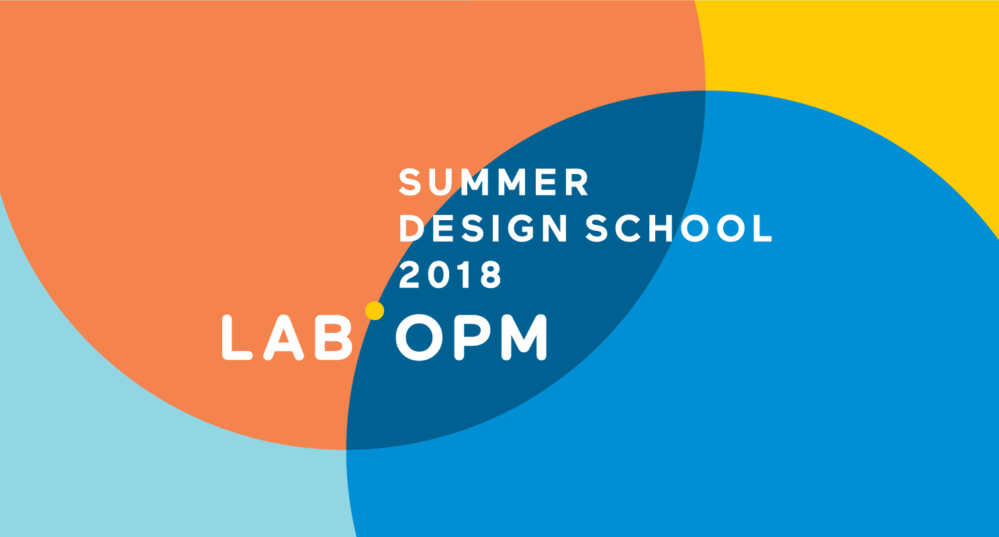

Summer Design School is a week-long workshop created by The Lab at OPM that experiments with new ways of teaching, learning, and applying human-centered design in the public sector. We will look at complex challenges through a series of different frames, with an emphasis on understanding why, when, and how to apply design thinking to projects.

We're looking forward to a great week and hope you can join us!

2018 Washington DC Summer Design School
June 18-22, 2018
The Lab at OPM
Washington DC

### [Download schedule and details (PDF)](https://github.com/labopm/washDC_SDS/blob/master/SDS_DC_preview_packet_V3.pdf)

Register: <https://lab.opm.gov/class-sign-up/>

p.s. On the west coast? [Check out 2018 Oakland Summer Design School](https://bit.ly/oaklandSDS)
